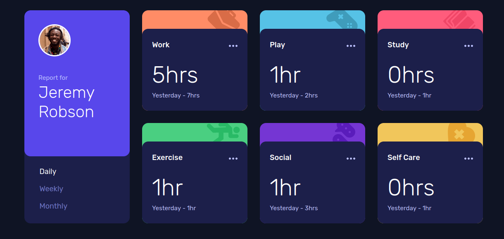

# Frontend Mentor - Time tracking dashboard solution

This is a solution to the [Time tracking dashboard challenge on Frontend Mentor](https://www.frontendmentor.io/challenges/time-tracking-dashboard-UIQ7167Jw). Frontend Mentor challenges help you improve your coding skills by building realistic projects.

## Table of contents

- [Frontend Mentor - Time tracking dashboard solution](#frontend-mentor---time-tracking-dashboard-solution)
  - [Table of contents](#table-of-contents)
  - [Overview](#overview)
    - [The challenge](#the-challenge)
    - [Screenshot](#screenshot)
    - [Links](#links)
  - [My process](#my-process)
    - [Built with](#built-with)
    - [What I learned](#what-i-learned)
    - [Useful resources](#useful-resources)
  - [Author](#author)
  - [Acknowledgments](#acknowledgments)

## Overview

### The challenge

Users should be able to:

- View the optimal layout for the site depending on their device's screen size
- See hover states for all interactive elements on the page
- Switch between viewing Daily, Weekly, and Monthly stats

### Screenshot

### Links

- Solution URL: [on Frontend Mentor](https://your-solution-url.com)
- Live Site URL: [On GitHub pages](https://seapagan-fem.github.io/time-tracking-dashboard/)

## My process

### Built with

- Semantic HTML5 markup
- CSS custom properties
- Flexbox
- CSS Grid
- Plain Javascipt
- Mobile-first workflow

### What I learned

I chose to use Radio buttons for the Daily/Weekly/Monthly selectors and style
them accordingly which simplified the JS logic a lot. I had originally intended
to use a styled list but think this is better.

I'm generally happy with the JS and think its quite clean and straight forward.

The time data is taken live from the JSON file, and I enjoyed parsing that and
filtering the data depending on which period is selected.

Styling was quite fun too, and getting the cards correct was more difficult
than it seemed at first glance. I styled mobile-first, and after that the
desktop version was very easy.

### Useful resources

- [Stack Overflow](https://stackoverflow.com/a/53336754/6641755) - Colouring the
  ellipsis SVG on hover was a pain, SVG loaded by IMG tag cannot have its color
  set by normal means (inline SVG can, but I didn't want to add the SVG to each
  card manually). Solution 3 on this answer helped me to do it using CSS
  filters. Note that using a lot of filters like that could cause performance
  issues on large projects.

## Author

- Website - [Grant Ramsay](https://www.gnramsay.com)
- Frontend Mentor - [@seapagan](https://www.frontendmentor.io/profile/seapagan)
- Twitter - [@gnramsay_dev](https://www.twitter.com/gnramsay_dev)

## Acknowledgments

Shout out to
[@ApplePieGiraffe](https://www.frontendmentor.io/profile/ApplePieGiraffe) for
pointing out in comment to one of my previous challenge solutions that Radio
buttons can simpify things when you only want one of many options active.
Prevoiusly I'd have used a styled list and then needed extra JS to handle the
states.
